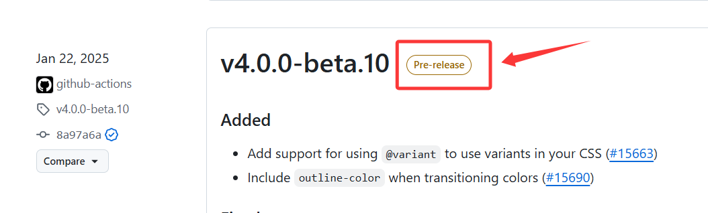

# 后续CI/CD 集成

当你成功推送到远程仓库后,你需要下面的步骤

1. 在github上创建[发行版](https://docs.github.com/zh/repositories/releasing-projects-on-github/managing-releases-in-a-repository)
2. 把构建产物推送到[npmjs](https://www.npmjs.com/)

您可以通过CI/CD来帮你自动完成上述的步骤。

<a id="gitHub-actions"></a>

## GitHub Actions

这里以GitHub Actions 工作流为例，在您的项目根目录下创建工作流文件（Workflow file）`.github/workflows/release.yml`(名称随意)

```yaml
name: Release

on:
  push:
    tags:
      - "v*"

permissions:
  contents: write # 使能够发布GitHub版本
  id-token: write # OIDC 发布所必须的

jobs:
  build:
    runs-on: ubuntu-latest
    steps:
      - name: Checkout
        uses: actions/checkout@v6
        with:
          fetch-depth: 0

      - name: Set up pnpm
        uses: pnpm/action-setup@v5

      - name: Set up Node
        uses: actions/setup-node@v4
        with:
          node-version: 24
          registry-url: "https://registry.npmjs.org"
          cache: "pnpm"

      - name: Install dependencies
        run: pnpm install

      - name: Build
        run: pnpm build

      - name: Publish to npm
        run: pnpm publish --no-git-checks

      - name: Generate a latest changelog
        run: pnpm exec smarty-release changelog -vv latest.md -o --latest
        env:
          GITHUB_REPO: ${{ github.repository }}

      - name: Github Release
        uses: softprops/action-gh-release@v2
        env:
          GITHUB_TOKEN: ${{ secrets.GITHUB_TOKEN }}
        with:
          body_path: latest.md
          prerelease: ${{ contains(github.ref_name, '-') }}
```

::: tip
由于在推送时您已经打了[Git tag](https://git-scm.com/docs/git-tag),当你 push 一个以 `v` 开头的 Git tag 时，这个名称为 `Release` 的工作流就会被触发。
:::

## 发布到npmjs

npmjs原本是可以申请永久有效的token的,但是在2025-12-09起npm官方开始发[博客](https://github.blog/changelog/2025-12-09-npm-classic-tokens-revoked-session-based-auth-and-cli-token-management-now-available/)要删除所有的永久有效的token，并且已经无法再生成永久有效的token，最长也只能90天的有效期。

npm官方建议取而代之的是使用[可信发布](https://docs.npmjs.com/trusted-publishers)。
可信发布功能允许您使用OpenID Connect (OIDC)身份验证直接从 CI/CD 工作流发布 npm 包，从而无需长期有效的 npm 令牌

### 可信发布快速指南

首先去[npmjs](https://www.npmjs.com/)登录后找到自己的包，点击`setting`按钮，然后配置仓库地址，以及流水线的名称，保存即可。

::: tip
更详细的图文步骤可以查看官方的文档[配置可信发布](https://docs.npmjs.com/trusted-publishers#configuring-trusted-publishing)。
:::

### 可能遇到的问题

在发布过程中，`npm publish`命令可能会报以下错误：

```
Error verifying sigstore provenance bundle:
Failed to validate repository information:
package.json: "repository.url" is "",
expected to match "https://github.com/xxx/xxxx" from provenance
```

因为可信发布会检测您是否正确配置了仓库,所以您需要在您的`package.json`添加以下配置：

```json{5-8}
{
  "name": "you-awesome-project",
  "version": "1.8.1",
  //...
  "repository": { // [!code ++]
    "type": "git", // [!code ++]
    "url": "https://github.com/owner/repository.git" // [!code ++]
  } // [!code ++]
}
```

## 创建github的Release

观察Github Action[工作流文件](#github-actions),这里是通过使用第三方 GitHub Action（eg. softprops/action-gh-release）来创建 GitHub Release。

关于[softprops/action-gh-release](https://github.com/softprops/action-gh-release)的用法可以去查看对应的文档用法。这里主要说明一下它是使用`Smarty-Release`的子命令`changelog`生成最后一个变更日志并写入到`latest.md`来作为Action的`body_path`参数。

简单理解：就是把你仓库中`CHANGELOG.md`中最新的版本变更日志单独拿出来。

::: tip
关于子命令`changelog`的详细说明[参阅](/reference/cli#changelog-command)。
:::

### Github Release 预发布

它的效果如下：


这里是通过`prerelease`选项来控制的。

```yaml{3}
with:
  body_path: latest.md
  prerelease: ${{ contains(github.ref_name, '-') }}
```

- github.ref_name ：当前触发工作流的 tag 名称
- contains(a, b)：GitHub Actions [表达式](https://docs.github.com/zh/actions/reference/workflows-and-actions/expressions) 里的内置函数

组合起来的意思就是判断 `tag` 里有没有 `-`。

例子：

| tag             | contains `-` | prerelease |
| --------------- | ------------ | ---------- |
| `v1.0.0`        | ❌           | false      |
| `v1.0.1`        | ❌           | false      |
| `v1.0.0-beta.1` | ✅           | true       |
| `v2.0.0-alpha`  | ✅           | true       |
