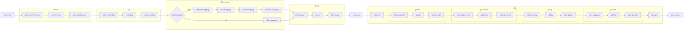

# 生命周期钩子

以下是`Smarty-Relase`的生命周期钩子执行顺序:

```mermaid
flowchart LR

  %% init
  A[before:init]

  %% selectVersion 阶段
  subgraph Version
    direction TB
    H2[before:selectVersion] --> E[selectVersion] --> H3[after:selectVersion]
  end

  %% selectTag 阶段
  subgraph Tag
    direction TB
    H4[before:selectTag] --> F[selectTag] --> H5[after:selectTag]
  end

  %% changelog 阶段
  subgraph Changelog
    direction TB
    G{hasChangelog?}
    G -->|yes| H6[before:changelog] --> I[genChangelog] --> H7[after:changelog] --> J[confirmChangelog]
    G -->|no| K[skip changelog]
  end

  %% bump 阶段
  subgraph Bump
    direction TB
    H8[before:bump] --> M[bump] --> H9[after:bump]
  end

  %% summary
  N[summary]

  %% git 阶段
  subgraph Git
    direction TB
    H10[before:git]

  subgraph git add
    direction TB
    H11[before:git.add] --> O[gitAdd] --> H12[after:git.add]
  end
  subgraph git commit
    direction TB
    H13[before:git.commit] --> P[gitCommit] --> H14[after:git.commit]
  end
  subgraph git tag
    direction TB
    H15[before:git.tag] --> Q[gitTag] --> H16[after:git.tag]
  end
  subgraph git push
    direction TB
    H17[before:git.push] --> R[gitPush] --> H18[after:git.push]
  end

    H18 --> H19[after:git]
  end

  %% end
  S[after:release]

  %% 主流程连接
  A --> H2
  H3 --> H4
  H5 --> G
  J --> H8
  K --> H8
  H9 --> N
  N --> H10
  H19 --> S
  H10 --> H11
  H12 --> H13
  H14 --> H15
  H16 --> H17
```
